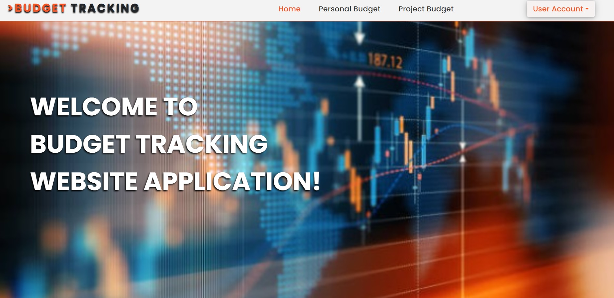

# Budget Tracking - Django Website Application



## About:
I have developed a client-facing web application using Django framework. This web application is designed to help 
users manage both personal budget and project-associated budget, all centralized within a single virtual environment. 
The goal is to provide users with a comprehensive tool to track their expenses, set budget limits, and analyze their 
financial data.

**Key Features**:

- Track income and expense;
- Generate financial reports;
- Visualize data with charts;

## Features extended:
- **Personal Budget Management**: Users can create, view, and manage their personal budgets, tracking income and 
- expenses across various categories.
- **Project Budget Management**: Users can also manage budgets for specific projects, allowing them to allocate funds, 
- track expenditures, and monitor financial progress for individual projects.
- **Centralized Dashboard**: A single, user-friendly dashboard provides an overview of all budgets, with visualizations 
- and summary statistics to help users quickly understand their financial status.
- **Expense and Income Tracking**: Users can log and categorize expenses and income, ensuring accurate tracking and reporting.
- **Budget Analysis**: The application offers analytical tools to help users identify spending patterns and make 
- informed financial decisions.

## Technologies Used
- **Front-end**: 
  - JavaScript
  - CSS
  - HTML
  
- **Back-end**: 
  - Django
  - SQLite
  
- **Programming Language**: 
  - Python

## Installation and Setup
To run this project locally, follow these steps:

1. **Clone the repository:**
   ```bash
   git clone https://github.com/margaretacrivat/BudgetTracking_PJ.git

2. **Navigate to the project directory:**
   ```bash
   cd BudgetTracking_PJ

3. **Create a virtual environment:**
   ```bash
   python -m venv env

4. **Activate the virtual environment:**
   - On Windows:
     ```bash
      .\env\Scripts\activate
     
   - On macOS/Linux: 
     ```bash
      source env/bin/ctivate
   
5. **Install the required dependencies:**
   ```bash
   pip install -r requirements.txt

6. **Apply the database migrations:**
   ```bash
   python manage.py migrate
   
7. **Run the development server:**
   ```bash
   python manage.py runserver
   
8. Open your browser and navigate to http://127.0.0.1:8000 to view the application.

## Usage

1. **Register an account** or **log in** if you already have one.
2. **Create a new personal budget** or **project budget**.
3. **Log expenses** and **track your spending**.
4. **Log income** and **track your source of income**.
5. Use the **dashboard** to get an overview of your financial status.

## License

This project is licensed under the MIT License. See the LICENSE file for more information.

## Resources: 
- [Django Documentation](https://docs.djangoproject.com/en/5.0/)

## Contact
- My name: Margareta Crivăț
- LinkedIn: [My LinkedIn](https://www.linkedin.com/in/margaretacrivat/)

For more information, please visit my [GitHub](https://github.com/margaretacrivat) profile.
